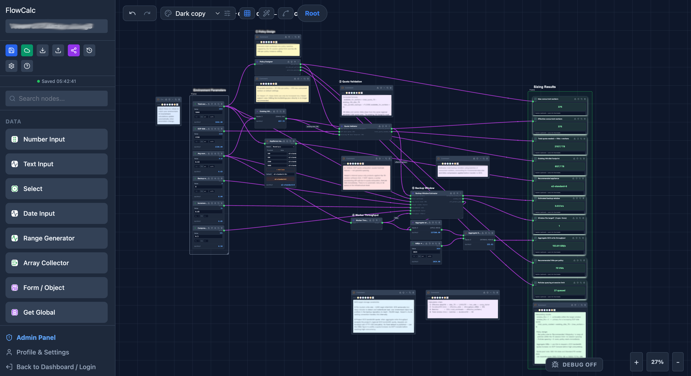

# FlowCal User Guide

FlowCal is a visual **node-graph editor and calculator**. Instead of writing a
formula in one box, you build a calculation out of small **nodes** wired
together — values flow left→right through the wires and every node updates in
real time as you edit.

  

This guide walks from your first flow to the more powerful features. If you just
want to run or deploy FlowCal, see the [README](../README.md).

---

## Contents

- [Core idea](#core-idea)
- [Philosophy & best practices](#philosophy--best-practices)
- [The canvas](#the-canvas)
- [Your first flow](#your-first-flow)
- [Nodes](#nodes)
- [Wiring nodes together](#wiring-nodes-together)
- [Making wires readable](#making-wires-readable)
- [Organising a flow](#organising-a-flow)
- [Reusable pieces: groups & custom nodes](#reusable-pieces-groups--custom-nodes)
- [Iterators: Map, Filter, Reduce](#iterators-map-filter-reduce)
- [Global variables & wireless links](#global-variables--wireless-links)
- [Saving, versions & sharing](#saving-versions--sharing)
- [Templates](#templates)
- [Themes & appearance](#themes--appearance)
- [Keyboard shortcuts](#keyboard-shortcuts)
- [Tips & troubleshooting](#tips--troubleshooting)

---

## Core idea

A flow is made of **nodes** connected by **wires**:

- A node takes zero or more **inputs** (ports on its left) and produces one or
  more **outputs** (ports on its right).
- A **wire** carries a value from one node's output into another node's input.
- FlowCal continuously **evaluates** the graph — change an input and every
  downstream node recalculates instantly. A **FINAL** node shows a headline
  result.

There's no compile/run step: the answer is always live on the canvas.

## Philosophy & best practices

FlowCal is more than a calculator — it's a way to make a calculation *visible*.
Two ideas guide how to get the most out of it. They aren't rules the tool
enforces; they're habits that make your flows a pleasure to read, trust, and
build on.

### 1. Aim for beautiful flows

A flow is a diagram people will read, so treat layout as part of the work, not
an afterthought. Clean connections and **minimal wire crossings** aren't just
tidy — every crossing is a place a reader can lose the thread, so fewer
crossings means a flow that explains itself.

- **Flow in one direction.** Keep inputs on the left and results on the right,
  following the way values travel. The **Tidy layout** button (the wand)
  arranges nodes by dependency as a starting point.
- **Reduce crossings.** Reorder a node's inputs, nudge nodes apart, and switch to
  **orthogonal routing** with the **draggable bend** to steer a wire cleanly
  *around* a node rather than behind it.
- **Align and space evenly.** Turn on grid **snap** and **align** so nodes line
  up; even spacing reads as intentional and calm.
- **Group related work.** Collapse a sub-calculation into a **group** (or a
  reusable **custom node**) so the top level shows the *shape* of the problem,
  not every detail. Use **frames** to visually cluster nodes that belong
  together.
- **Use colour for meaning, not decoration.** Colour the one wire that carries
  the key value so the eye finds it; don't paint everything. (The fire and
  sparks animations are just for fun — a calm **Pulse** or **None** usually reads
  best for a serious flow.)

A good test: could someone glance at a screenshot of your flow and understand its
shape *before* reading a single node?

### 2. Design for explainability

This is the heart of FlowCal. A formula like `(base + tax) * qty * (1 - discount)`
hides its reasoning behind syntax — you have to *be* a programmer to read it, and
even then the intent is left unsaid. FlowCal turns that same logic into something
**anyone** can open, follow, question, comment on, and change. Explainability is
the point; the calculator is how you get there.

It doesn't happen by accident — it's a practice:

- **Name things.** Give inputs and groups plain names (`Tax rate`,
  `Monthly cost`) so the graph reads like a sentence, not a puzzle.
- **Label the wires that matter.** If a connection's purpose isn't obvious from
  the nodes it joins, give it a label. A reader should never have to guess what a
  value *is*.
- **Comment the *why*, not the *what*.** Use **Comment** and **Text Label** nodes
  to record assumptions, sources, and decisions — the things a formula can never
  say ("rate from the 2026 schedule", "rounds up, per policy").
- **Name your constants.** Put shared values in **global variables** (`VAT = 0.2`)
  and read them with **Get Global**, so a number carries a meaning and lives in
  one place.
- **Build concepts, not just arithmetic.** Wrap a meaningful step in a group or
  custom node named after the *idea* it represents (`Shipping cost`,
  `Depreciation`). The flow then tells its story at the level people actually
  think in.
- **State the headline.** End with a **Final Result** node and a caption that says
  what the number means, and its units.

The payoff is a flow that's **auditable**. Someone who doesn't write code can
open it, reason about whether it's right, leave a comment, adjust an input, and
contribute — the way a spreadsheet invites scrutiny, but with the logic laid out
in the open instead of buried in cells. Calculations you can *see and discuss*,
not just run — that's what FlowCal is for.

## The canvas

- **Pan** — hold **Space** and drag, or drag an empty part of the canvas.
- **Zoom** — the `+ / – / %` controls (bottom-right), or scroll.
- **Add nodes** — open the **sidebar** (node palette) and pick a node; it drops
  onto the canvas.
- **Select** — click a node. **Shift-click** to add/remove nodes from the
  selection, or drag a box around several. **Esc** clears the selection.
- **Move** — drag a selected node. Turn on grid **snap** / **align** from the
  grid menu for tidy placement.

## Your first flow

Let's build `(base + tax) × qty`.

1. Add three **Number Input** nodes and set them to `base`, `tax`, and `qty`
   values.
2. Add a **Sum** node. Wire `base` → Sum, and `tax` → Sum.
3. Add a **Multiply** node. Wire the Sum node's output → Multiply, and `qty` →
   Multiply.
4. Add a **Final Result** node and wire the Multiply output into it.

The Final Result node now shows the result and updates the instant you change
any input. That's the whole model — everything else is more node types and
conveniences.

> Prefer to start from a formula? FlowCal can generate a flow from an expression
> like `(base + tax) * qty` — see [`skills/calc-to-flowcal/`](../skills/calc-to-flowcal/).

## Nodes

FlowCal ships **100+ node types**, grouped by category in the sidebar:

| Category | Examples |
|---|---|
| **Input / Data** | Number, Text, Date, Select, Form, Range |
| **Math** | Sum, Subtract, Multiply, Divide, Power, Round, Ceil/Floor, Min/Max |
| **Logic** | Compare, If/Else |
| **String** | Concat, Split, Replace, Template |
| **Array** | Slice, Sort, Get, Length, Flatten |
| **Object** | Pack, Unpack, Get Key, Combine, Lookup |
| **Date** | date maths and formatting |
| **Iterators** | Map, Filter, Reduce (+ their context nodes) |
| **Visuals** | Gauge, Progress, Line/Bar chart, Table, Report |
| **Advanced** | Custom (write JavaScript), Group, Function, Warp, globals |
| **Layout** | Comment, Text Label, Frame |

Every node's ports have tooltips, and many have a small ⓘ marker describing what
they expect. Double-click a wire's midpoint to add a label if a connection needs
explaining.

### Values and results

- **Number / Text / Date / Select** nodes are your entry points — type a value
  and it flows downstream.
- Most nodes show their computed output inline.
- A **Final Result** node is a display sink: it shows a big headline value with
  an optional caption, decimal precision, and unit suffix.

## Wiring nodes together

- **Connect** — drag from an **output** port (right side of a node) to an
  **input** port (left side of another). Drop anywhere on the target node and
  FlowCal snaps to the nearest input.
- **Highlight** — click a wire to highlight it and see exactly which two ports it
  joins.
- **Delete** — double-click a wire.
- **Label** — hover a wire and click the **+** at its midpoint (or double-click
  an existing label) to name the connection.

## Making wires readable

Dense flows can get busy. A few tools help:

- **Routing mode** — the toolbar toggle switches between **curved** (bezier) and
  **orthogonal** (right-angle) wires.
- **Draggable bend** — in orthogonal mode, select a wire and drag the small
  handle on its vertical run left/right to tidy the routing (double-click the
  handle to reset). Handy for routing a wire *around* a node instead of behind
  it.
- **Per-wire colour** — select a wire and pick a colour from the swatch palette
  to make an important connection stand out (the **×** clears it).
- **Wire animation** — a toolbar button cycles the flowing-particle style for the
  whole flow: **Pulse**, **Fire** 🔥, **Sparks** ✨, or **None**. Purely cosmetic,
  and it saves with the flow.

## Organising a flow

- **Frames** — drop a **Frame** behind a cluster of nodes to visually group and
  label an area.
- **Comments & Text Labels** — annotate the canvas with notes and headings; they
  don't affect the calculation.
- **Tidy layout** — the wand button auto-arranges nodes left→right by dependency.

## Reusable pieces: groups & custom nodes

**Groups** let you collapse a sub-calculation into a single node:

1. Select two or more nodes and press **Ctrl/Cmd + G** (or use the toolbar) to
   group them.
2. The group appears as one node with input/output ports derived from
   **Group Input** / **Group Output** nodes inside it.
3. **Double-click** the group to go *inside* and edit its contents; use the
   breadcrumb bar to jump back out.
4. Collapse a group to keep the canvas tidy — it still shows each output's value.

**Custom nodes** turn a group into a named, reusable building block you can drop
into any flow. You can export a custom node as JSON and import it elsewhere.

## Iterators: Map, Filter, Reduce

Iterators run a small sub-flow over each item of an array:

- **Map** — transform every item. Double-click to define the per-item logic using
  the **Item** / **Index** / **Output** context nodes.
- **Filter** — keep items that match a condition, defined with **Item** /
  **Index** / **Include** (connect a truthy value to *Include* to keep the item).
- **Reduce** — collapse an array to a single value using **Item** /
  **Accumulator** / **Output**, starting from an initial value.

Double-click any iterator node to edit its inner logic, just like a group.

## Global variables & wireless links

- **Global variables** — define named values once (in the flow settings) and read
  them anywhere with a **Get Global** node. Great for shared constants like a tax
  rate.
- **Warp (wireless) links** — a **Warp In** tagged with a name broadcasts a value;
  any **Warp Out** with the same tag receives it — no visible wire. Useful for
  values used in many far-apart places.

## Saving, versions & sharing

Signed in, your flows live in the cloud (Dashboard).

- **Save / Autosave** — save manually, or enable **autosave** to persist as you
  edit. If the same flow is open in two tabs/devices, FlowCal detects a
  conflicting save and asks whether to **reload** the other version or
  **overwrite** it — no silent clobbering.
- **Version history** — snapshot the flow and restore an earlier version
  non-destructively from the history drawer.
- **Sharing** — make a flow public and copy a share link. Recipients open a
  read-only **guest** view (`/guest/:id`) that honours locked nodes. From the
  Dashboard you can **duplicate** any flow shared with you into your own.

## Templates

The Dashboard shows a **Templates** gallery of ready-made flows. Click **Use
template** to start a fresh copy in your own account. (Admins publish templates
from the admin **All Flows** tab.)

## Themes & appearance

FlowCal includes six themes (light, dark, cyberpunk, dracula, ocean, forest).
Switch from the theme control; your choice is remembered per browser.

## Keyboard shortcuts

| Action | Shortcut |
|---|---|
| Copy / Cut / Paste | `Ctrl/Cmd + C` / `X` / `V` |
| Duplicate selection | `Ctrl/Cmd + D` |
| Group selection | `Ctrl/Cmd + G` |
| Undo / Redo | `Ctrl/Cmd + Z` / `Ctrl/Cmd + Shift + Z` (or `Ctrl/Cmd + Y`) |
| Pan the canvas | hold **Space** and drag |
| Multi-select | **Shift**-click, or drag a selection box |
| Clear selection | **Esc** |
| Enter a group | double-click the group node |
| Delete a wire | double-click the wire |

## Tips & troubleshooting

- **A wire mis-targets a port?** Click the wire to highlight it and confirm the
  two ports it joins; re-drag it onto the intended input.
- **A node shows an error box on the canvas?** One node failing no longer takes
  down the whole editor — fix its input or use its **Retry** / **Delete**
  buttons.
- **Nothing evaluates?** Make sure your inputs are actually wired through to a
  Final Result (or a visual) node — unconnected inputs don't flow anywhere.
- **Big flow feels heavy?** Set the wire animation to **None** and collapse
  groups you're not editing.

---

Questions or ideas? See [`CONTRIBUTING.md`](../CONTRIBUTING.md), or open an issue.
